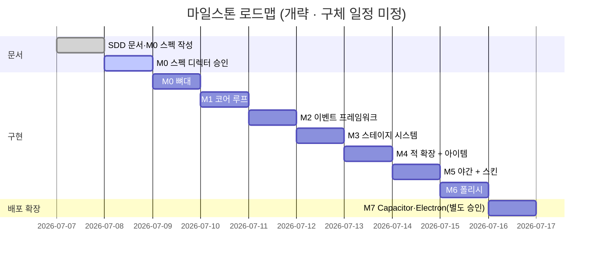

# EGG FLIP (가제)

> 1인칭 계란후라이 아케이드. 손님 주문대로 계란을 깨서 굽고, 낚시 캐스팅식 파워 게이지로 팬을 뒤집고, 사방에서 난입하는 방해꾼을 몇 초 안에 **올바른 입력**으로 처리하면서, 최대한 완벽한 원에 가까운 후라이를 만든다. 점수는 원형도 기반 소수점 3자리(100.000점은 사실상 불가능). — [GDD §1](GDD.md)
>
> 레퍼런스 톤: **Bacon – the game (kamibox)** — 미니멀하고 부드러운 손그림 느낌의 2D, 유머 있는 연출, 오브젝트 소수 정예.

| 항목 | 상태 |
| --- | --- |
| 상태 | ✅ **M3 Verified** — JSON 스테이지·결과 화면(별점·PNG 공유) · 테스트 127 + Playwright · 브랜치 `feat/m1-core-loop` |
| 플랫폼 | 1차: **모바일 웹(세로 9:16)** + 데스크톱 웹 · 2차: Capacitor(iOS/Android) / Electron + steamworks.js(Steam) |
| 스택 | Phaser 3 + TypeScript(strict) + Vite · Vitest · 자체 EventBus(외부 상태관리 라이브러리 금지) |
| 레포 | github.com/mooner92/happyeggs · 문서 브랜치 `main` · 구현 브랜치 `feat/m{n}-*` · 문서화 시작 2026-07-07 |

---

## 핵심 개념 — 스펙이 코드에 앞선다 (SDD)

이 레포는 SDD(Spec Driven Development)로 개발한다. 단일 진실 소스(SSOT)는 **[GDD.md](GDD.md)** 하나뿐이며, 모든 코드는 GDD를 마일스톤 단위 스펙(`docs/specs/M{n}-*.md`)으로 구체화하고 **디렉터 승인을 받은 뒤에만** 작성한다.


- **마일스톤 게이트:** M0(뼈대)~M7 순서대로만 진행하며, 스펙이 **Approved**가 되기 전에는 구현하지 않는다. 마일스톤 건너뛰기·병합 금지(GDD §13).
- **스펙 상태:** Proposed → Approved → Implemented → Verified. 현재 [M0 스펙](docs/specs/M0-skeleton.md)은 **Approved**(2026-07-07)다.
- **임의 결정 금지:** GDD와 충돌하거나 GDD에 없는 판단은 [docs/DECISIONS.md](docs/DECISIONS.md)에 [DECISION]으로 기록하고 디렉터에게 묻는다. 확정된 결정은 [docs/adr/](docs/adr/README.md)로 승격한다.

---

## 게임 한눈에

### 코어 루프 (GDD §5)

1. 대기열 맨 앞 손님이 주문 — 말풍선에 계란 아이콘 × N
2. 계란을 **N번 탭** → 팬 위에 깨짐(블롭 생성) — 깨는 위치·간격이 최종 모양에 영향
3. 익힘 진행(열원별 속도) — 흰자가 퍼지는 시뮬레이션
4. **홀드-릴리즈** 파워 게이지로 뒤집기 → 짧은 2차 익힘 → 손님 방향 스와이프로 서빙 **[DECISION-03] 미결**
5. 서빙 즉시 원형도 채점(Q = 4πA/P²) 팝업 — 소수점 3자리
6. 방해꾼 이벤트가 2~5 사이에 랜덤 삽입 — 멀티태스킹 압박
7. 스테이지 종료: **성공** = 대기열 소진 / **실패** = 스프링클러 · 재고 부족 · 즉사형 이벤트(재채기)

### 화면 구성 (GDD §4)

```
┌────────────────────┐
│ 원경 (건물 → 저격수 등장)   │
│ 손님 대기열 (말풍선 주문)    │
│      [주방 카운터]          │
│  아이템   아이템   아이템    │  ← 스테이지별 배치 상이
│        🍳 팬 (중앙)         │
│ 왼손(팬 손잡이)  오른손(뒤집개)│  ← 1인칭 양손
│ HUD: 계란재고 / 점수 / 손님수 │
└────────────────────┘
```

### 입력 사전 (전 플랫폼 공통 · GDD §4)

| 제스처 | 용도 |
| --- | --- |
| 탭 | 계란 깨기, 아이템 사용, 파리 처치, 스토브 재점화 |
| 더블탭 (250ms 내 2회) | 고양이 소환 (강도 퇴치) |
| 홀드 → 릴리즈 | 팬 뒤집기 파워 게이지 |
| 드래그 | 거미줄 절단 |
| 스와이프 (손님 방향) | 완성 후라이 서빙 **[DECISION-03]** |

입력은 `pointerdown` 기준(click 지연 금지), 마우스=터치 동일 매핑(GDD §2).

---

## 빠른 시작 (Quickstart)

> [!IMPORTANT]
> **M0 스캐폴드부터 실행 가능하다** — 구현은 `feat/m0-skeleton` 브랜치에서 진행 중이다. Node 22+ 기준.

```bash
git clone https://github.com/mooner92/happyeggs.git
cd happyeggs

npm install               # 의존성 설치
npm run dev               # 로컬 개발 서버 (Vite, --host 포함)
npm run dev               # 동일 네트워크 폰 브라우저에서 세로 9:16 확인 (터미널의 Network URL 접속)
npm run test              # Vitest — 순수 로직만
npm run lint              # eslint
npm run build             # 타입체크 + 정적 빌드 (Vercel / GitHub Pages / itch.io 겨냥)
```

---

## 레포 구조

`src/`는 [M0 스펙](docs/specs/M0-skeleton.md)의 파일 계획 구조이며, `feat/m0-skeleton` 브랜치에서 구현이 진행 중이다.

```text
happyeggs/
├── GDD.md               # ★ 게임 디자인 문서 — 단일 진실 소스(SSOT)
├── README.md            # ← 지금 이 문서 (진입점)
├── CLAUDE.md            # Claude Code 작업 규칙 (⛔ 절대 규칙)
├── WORKPLAN.md          # M0~M7 마일스톤 체크리스트 (DoD)
├── docs/                # 📚 설계 문서
│   ├── README.md        #   문서 인덱스 + 표기 규약
│   ├── 01-overview.md ~ 05-conventions.md
│   ├── DECISIONS.md     #   미결 [DECISION] 로그
│   ├── adr/             #   확정 결정 기록 (ADR 0001~0008)
│   └── specs/           #   마일스톤 스펙 (M0-skeleton.md — Approved)
└── src/                 # 🛠 M0 구현 — feat/m0-skeleton 브랜치에서 작성
    ├── main.ts          #   Phaser.Game 부트스트랩
    ├── scenes/          #   Boot / Preload / Game / Result
    ├── systems/         #   순수 TS — Phaser import 금지 (Vitest 대상)
    ├── ui/              #   뷰·디버그 HUD
    └── data/            #   balance(튜닝 수치) / palette / layout / assets — 분리 구조는 [ADR-0008](docs/adr/0008-balance-file-scope.md)
```

---

## 문서 지도

시작은 [docs/README.md](docs/README.md)(인덱스).

| 문서 | 한 줄 설명 |
| --- | --- |
| [GDD.md](GDD.md) | ★ SSOT — 게임 디자인·규약·마일스톤 전체 |
| [CLAUDE.md](CLAUDE.md) | Claude Code 작업 규칙 · ⛔ 절대 규칙 |
| [WORKPLAN.md](WORKPLAN.md) | M0~M7 마일스톤 체크리스트(DoD) |
| [docs/README.md](docs/README.md) | 문서 인덱스 + 표기 규약 |
| [docs/01-overview.md](docs/01-overview.md) | 개요·타깃·성능 예산 |
| [docs/02-architecture.md](docs/02-architecture.md) | 기술 아키텍처 — 순수 모델/뷰 분리, 씬 흐름, EventBus |
| [docs/03-game-systems.md](docs/03-game-systems.md) | 게임 시스템 설계(엔지니어링 관점) |
| [docs/04-testing.md](docs/04-testing.md) | 테스트 전략 — 순수 로직만 Vitest |
| [docs/05-conventions.md](docs/05-conventions.md) | 개발 규약·기여 가이드 |
| [docs/DECISIONS.md](docs/DECISIONS.md) | 미결 [DECISION] 로그 (현재 12건 전부 미결) |
| [docs/adr/README.md](docs/adr/README.md) | ADR 인덱스 — 스택·EventBus·SDD 문서 구조 |
| [docs/specs/README.md](docs/specs/README.md) | SDD 프로세스·스펙 템플릿 |
| [docs/specs/M0-skeleton.md](docs/specs/M0-skeleton.md) | M0 스펙 (상태: **Approved**) |

> [!TIP]
> **독자별 추천 경로**
> - **디렉터(기획):** README → [docs/01-overview.md](docs/01-overview.md) → [GDD.md](GDD.md)
> - **개발자:** [CLAUDE.md](CLAUDE.md) → [docs/02-architecture.md](docs/02-architecture.md) → [docs/03-game-systems.md](docs/03-game-systems.md) → [docs/specs/M0-skeleton.md](docs/specs/M0-skeleton.md)

---

## 상태 & 로드맵

**문서화 시작** 2026-07-07 · **현재 단계** ✅ M4 Verified + 구체화([ADR-0010](docs/adr/0010-diegetic-kitchen-scene.md)) + GPGP 손님 루프·코인 경제([ADR-0011](docs/adr/0011-gpgp-customer-loop-and-coins.md), 2026-07-09) — 서빙 리액션·팁·지갑 v2 + 코어 확장(드리프트·뒤집개 모으기, ADR-0012) + 디자인 v1(손님 개성·팬 질감·갈변 링·칩 HUD·전환 연출). 다음: M5 야간+스킨(코인 상점).

미결 결정: GDD §16 **DECISION-05(가로 화면)**만 미결 + 구현 파생 **08(총알 구멍)**. 01·02·04·06은 M4 스펙, 03·07은 M1·M3, M0-1~5는 ADR-0004~0008로 확정 — [docs/DECISIONS.md](docs/DECISIONS.md).

### 마일스톤 현황 (GDD §13)

| # | 이름 | 한 줄 요약 | 상태 |
| --- | --- | --- | :---: |
| M0 | 뼈대 | Vite+Phaser+TS 셋업, 4씬 구조, 세로 레이아웃, 탭으로 계란 깨기→블롭, 익힘 FSM, 디버그 HUD | ✅ Verified |
| M1 | 코어 루프 | 왕복 파워 게이지+뒤집기 판정 전부, 원형도 채점+테스트, 서빙, 손님 큐, 하드코딩 스테이지 1개 클리어 | ✅ Verified |
| M2 | 이벤트 프레임워크 | 스케줄러, telegraph→window→resolve 파이프라인, 거미+강도 2종 완전 구현 | ✅ Verified |
| M3 | 스테이지 시스템 | JSON 스테이지 로더, 실패 조건 3종, 결과 화면, PNG 합성/Web Share | ✅ Verified |
| M4 | 적 확장 + 아이템 | 저격수·파리·재채기·머리카락, 아이템 배치+미스리드(decoy), 도난→방어 불가 연쇄 | ✅ Verified |
| M5 | 야간 + 스킨 | 열화상 셰이더, 불 끄기 적+가짜불 스티커, 스킨 스키마/상점 UI/장착 저장 | ⏳ 대기 |
| M6 | 폴리시 | 이징/파티클/화면 흔들림, SFX 스텁 훅, 성능 패스(폰 실측 60fps), balance.ts 1차 튜닝 | ⏳ 대기 |
| M7 | 배포 확장 (별도 승인) | Capacitor 앱 래핑, Electron + steamworks.js — 지금은 문서화만 | ⏳ 대기 |



> [!NOTE]
> 위 간트는 **순서만** 보여주는 개략도다. 구체 날짜·기간은 전부 미정이며, 각 마일스톤은 이전 마일스톤의 검증·리뷰 통과 후에만 시작한다. 진행 상황은 [WORKPLAN.md](WORKPLAN.md)에서 관리한다.

---

## ⛔ 개발 절대 규칙 (요약)

전체 규칙과 근거는 [CLAUDE.md](CLAUDE.md)에 있다. 본문·예시 어디서도 약화시키지 말 것.

1. **마일스톤 순서 + 승인 게이트.** M0~M7 순서대로만, 건너뛰기·병합 금지. 스펙 Approved 전 구현 금지, 마일스톤 종료 시 정지·리뷰 대기.
2. **임의 결정 금지.** GDD에 없는 판단은 [docs/DECISIONS.md](docs/DECISIONS.md)에 [DECISION]으로 기록하고 디렉터에게 확인한다.
3. **밸런스 수치는 `src/data/balance.ts` 단일화.** 시간·계수·판정 윈도우·감점량 전부. 매직넘버 인라인 금지.
4. **유닛테스트는 순수 로직만.** 채점·익힘 모델·뒤집기 판정·이벤트 스케줄러. 렌더링 테스트 금지.
5. **성능 예산 준수.** 미드레인지 안드로이드 60fps · 초기 번들 < 3MB · update 루프 내 per-frame 객체 할당 금지 · 입력은 `pointerdown` 기준.

---

## 기술 스택 (GDD §3 — 고정, 변경 제안 금지)

| 영역 | 선택 | 비고 |
| --- | --- | --- |
| 엔진 | Phaser 3 최신 안정판 | **물리엔진 미사용** — 자체 간이 시뮬 |
| 언어 | TypeScript (`strict: true`) | 코드/식별자 영어, 주석·문서 한국어 |
| 빌드 | Vite | `base` 옵션 유연하게 — Vercel / GitHub Pages / itch.io 겨냥 |
| 상태 관리 | 씬 로컬 상태 + 자체 경량 EventBus | 외부 상태관리 라이브러리 금지 ([ADR 0002](docs/adr/0002-custom-eventbus-no-state-lib.md)) |
| 계란 렌더 | `Phaser.GameObjects.Graphics` 폴리곤 + 스무딩 | 방사형 정점 블롭 (GDD §6.1) |
| 저장 | localStorage 래퍼 | schema version 필드 포함 — 진행도/스킨 |
| 공유 | 오프스크린 Canvas → PNG → Web Share API | 미지원 시 다운로드 + 클립보드 |
| 테스트 | Vitest | 순수 로직만 — 렌더링 테스트 금지 |
| 린트 | eslint + prettier | 기본 설정 |
| 배포 | 정적 빌드 | 초기 로드 번들 < 3MB, 에셋 lazy load |

---

## 관련 문서

**문서 인덱스:** [docs/README.md](docs/README.md) · **작업 규칙:** [CLAUDE.md](CLAUDE.md) · **작업 계획:** [WORKPLAN.md](WORKPLAN.md) · **SSOT:** [GDD.md](GDD.md)

| 이전 | 다음 |
| --- | --- |
| — (최상위 진입 문서) | [docs/01-overview.md →](docs/01-overview.md) |

---

최종 수정: 2026-07-07 (M0 스펙 승인 — M0-1~5 확정(ADR-0004~0008), 구현 착수)
