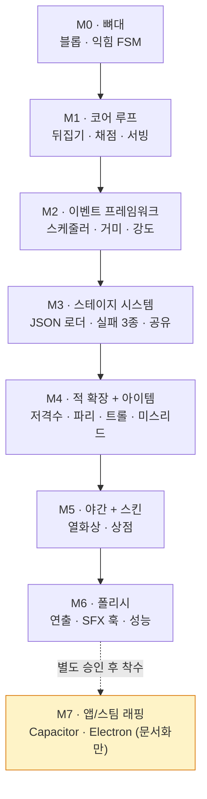

# WORKPLAN — 마일스톤 실행 계획 (M0~M7)

> "EGG FLIP (가제)"를 **빈 레포에서 v1까지** 끌고 가는 마일스톤별 체크리스트다. 설계의 "왜"는 [GDD.md](GDD.md)(SSOT)와 [docs/](docs/README.md)에, "무엇을 언제"는 이 문서에 둔다.
> 마일스톤은 **M0→M7 순서로만** 진행하며, 건너뛰기·병합은 금지한다(GDD §0·§13).

---

## 사용법 / 범례

이 문서는 마일스톤별 체크리스트다. 작업 항목은 `- [ ]`(미완료) / `- [x]`(완료)로 표시한다.

| 표기 | 의미 |
|---|---|
| `- [ ]` | 아직 하지 않은 작업 |
| `- [x]` | 끝낸 작업 (커밋/검증 완료) |
| **DoD** | 완료의 정의(Definition of Done). GDD §13 인수 조건 기준 — 전부 참이어야 마일스톤 종료 |
| **선행조건** | 이 마일스톤 시작 전에 충족돼야 하는 것 |
| `> [!IMPORTANT]` + "확인 필요:" | 아직 확정되지 않은 사실(미결 [DECISION] 등). 확정 전 단정 금지 |

> [!NOTE]
> 마일스톤마다 SDD 루프가 반복된다: ① 스펙 작성(`docs/specs/M{n}-*.md`) → ② 디렉터 승인(미결 결정 확정 → `docs/adr/` 승격) → ③ 구현(브랜치 `feat/m{n}-*`, 작은 conventional commits) → ④ 검증(인수 조건 체크리스트 + Vitest) → ⑤ 문서 동기화(스펙 as-built·WORKPLAN 체크·README 상태) → **정지·리뷰 대기**. 각 마일스톤 종료 시 반드시 정지하고 디렉터 리뷰를 기다린다. 상세는 [docs/specs/README.md](docs/specs/README.md).

> [!NOTE]
> **진행 상태(2026-07-07):** 코드 0줄, 문서 단계. 문서 체계(README / CLAUDE / WORKPLAN / docs / adr / specs) 구축 완료. M0 스펙([docs/specs/M0-skeleton.md](docs/specs/M0-skeleton.md))은 **Approved**(2026-07-07 승인, M0-1~5 기본안 일괄 채택 → ADR-0004~0008) — `feat/m0-skeleton`에서 구현 진행.
> 미결 결정: GDD §16 **DECISION-01~07(7건)은 미결**, M0-1~5는 확정(ADR-0004~0008) — [docs/DECISIONS.md](docs/DECISIONS.md).

---

## 마일스톤 개요 (GDD §13)

| 마일스톤 | 목표 | 주요 산출물 | 완료기준(요약) |
|---|---|---|---|
| **M0 뼈대** | Vite+Phaser+TS 뼈대 + 계란 깨기·익힘 | 4씬 구조, 세로 레이아웃, 블롭 생성/퍼짐, 익힘 FSM, 디버그 HUD | 폰에서 계란 깨고 타는 것 육안 확인 + 익힘 모델 Vitest 통과 |
| **M1 코어 루프** | 뒤집기→채점→서빙 한 판 완성 | 왕복 파워 게이지, 뒤집기 판정 4종, 원형도 채점(Q=4πA/P²), 손님 큐, 재고 HUD | 하드코딩 스테이지 1개 클리어 가능 + 채점 유닛테스트 통과 |
| **M2 이벤트 프레임워크** | 데이터 주도 방해꾼 시스템 | 스케줄러(eventBudget/cooldown), telegraph→window→resolve 파이프라인, 거미·강도 2종 | 조리 중 2종 이벤트가 성공/실패 연출까지 완동 |
| **M3 스테이지 시스템** | 스테이지 단위 플레이 완성 | JSON 스테이지 로더, 실패 조건 3종, 결과 화면, PNG 합성/Web Share | 스테이지 시작→종료→결과 공유가 이어짐 |
| **M4 적 확장 + 아이템** | 적 전체 + 미스리드 재미 | 저격수·파리·재채기·머리카락, 아이템 배치 + decoy, 도난→방어 불가 연쇄 | 적 6종 + 아이템 미스리드 전부 동작 |
| **M5 야간 + 스킨** | 야간 변형 + BM 스캐폴드 | 열화상 셰이더, 불 끄기 적 + 가짜불 스티커, 스킨 스키마/상점 UI/장착 저장 | 야간 스테이지 플레이 + 스킨 장착이 localStorage에 저장 |
| **M6 폴리시** | 게임필 + 성능 마감 | 이징/스쿼시&스트레치/파티클, SFX 스텁 훅 전체, 성능 패스, balance.ts 튜닝 시트 | 폰 실측 60fps + 초기 번들 < 3MB |
| **M7 앱/스팀 래핑** | 2차 플랫폼 (지금은 문서화만) | Capacitor 래핑, Electron + steamworks.js 빌드 | **별도 승인 후 착수** — 승인 전 작업 금지 |

---

## 마일스톤 의존성

## M0 — 뼈대 (스펙: Approved — 구현 진행)

### 목표
빈 레포에 Vite + Phaser 3 + TS(strict) 뼈대를 세우고, 폰 브라우저에서 **"계란을 깨고 타는 것"을 눈으로 확인 가능한** 상태까지 만든다.
순수 모델/뷰 분리(`systems/`·`data/`는 Phaser import 금지)와 결정론(dt 주입 · 시드 난수)을 처음부터 강제한다.

### 선행조건
- [x] M0 스펙([docs/specs/M0-skeleton.md](docs/specs/M0-skeleton.md)) 디렉터 승인 (Proposed → Approved, 2026-07-07)
- [x] 미결 결정 M0-1~5 확정 → `docs/adr/` 승격 (ADR-0004~0008: 720×1280 / 실시간 / 0.1s 클램프 / 자체 밸류 노이즈 / 튜닝 수치만 balance.ts)

> [!IMPORTANT]
> **확인 필요: GDD §16의 DECISION-01~07은 여전히 미결**이다(주로 M1·M4에서 필요). 확정 전에 확정된 것처럼 구현하지 않는다 — [docs/DECISIONS.md](docs/DECISIONS.md).

### 작업 체크리스트 (커밋 단위 — M0 스펙 §7, 각각 빌드·테스트 그린 유지)
- [x] 1. `chore: scaffold vite + phaser3 + ts(strict) + vitest + eslint/prettier` — 모바일 메타(touch-action 등)·vite base 포함
- [x] 2. `docs: sync architecture and decision log with m0 scaffold` — 기작성 문서(docs/02-architecture·DECISIONS)에 구현 확정 사항 반영
- [x] 3. `feat: add data modules (balance/assets/palette/layout)` — 상수 홈 먼저, 매직넘버 원천 차단
- [x] 4. `feat: add scene skeleton with 9:16 FIT scaling` — 4씬 배선
- [x] 5. `feat: add typed event bus and m0 event definitions` (+test)
- [x] 6. `feat: add seeded 1d value noise` (+test)
- [x] 7. `feat: add egg blob model (radial vertices, spread, smoothing)` (+test)
- [x] 8. `feat: add cooking fsm model` (+test) — 여기까지가 인수조건 Vitest 분
- [x] 9. `feat: render pan and hands placeholders`
- [x] 10. `feat: crack eggs on pointerdown and render spreading blobs`
- [x] 11. `feat: drive cooking states with color changes and smoke warning`
- [x] 12. `feat: add debug hud (state/doneness/timer/fps)` — Result 디버그 진입 버튼 포함
- [x] +`fix:` 코드리뷰 확정 4건 반영 (블롭 seam·heatCoeff 가드·노른자 상한·smoke 환산 테스트)

### 산출물
- 4씬(Boot/Preload/Game/Result) + 세로 9:16 FIT 스케일링 + 모바일 뷰포트 메타 + 디버그 HUD(상태/doneness/타이머/fps)
- 순수 모델: EventBus / noise / CookingModel / EggBlobModel (+ Vitest, `src/systems/` co-locate)
- data 모듈: `balance.ts`(★ 튜닝 수치) · `assets.ts`(빈 매니페스트) · `palette.ts` · `layout.ts`

### 완료의 정의 (DoD — GDD §13 M0 인수 조건)
- [x] `npm run test` 전체 통과 — **43 테스트**(익힘 모델 포함) + `tsc`·`eslint`·`build` 그린
- [x] 팬 탭으로 계란을 깨고, 블롭이 퍼지고, RAW→…→SMOKE 색 변화(타는 것)까지 **Playwright 시각 QA로 검증** (`npm run qa` → `qa/shots`, 콘솔 에러 0)
- [x] 스펙 as-built 갱신([docs/specs/M0-skeleton.md](docs/specs/M0-skeleton.md) §12) + 이 문서 체크 + README 상태 갱신

> [!NOTE]
> 스펙 상태 **Verified**(2026-07-08 — 테스트 43 + Playwright 시각 QA 통과). Playwright 검토로 UX 3건(두부 텍스트·뒤집개·팬 바닥) 개선 반영. M1 착수 가능.

### 리스크
- **dt 스파이크**: 탭 이탈 후 복귀 시 큰 dt 1회로 계란이 즉시 전소 → dt 클램프(0.1s — [ADR-0006](docs/adr/0006-dt-clamp-background.md))로 방어.
- **Graphics 비용**: 블롭 폴리곤(계란 최대 3개 × 정점 48개)을 매 프레임 다시 그림 → 디버그 HUD의 fps로 폰 실측 상시 확인.
- **모바일 뷰포트**: 주소창 개입·더블탭 줌·스크롤 → `100dvh`, `touch-action: none`, `user-scalable=no`로 차단(M0 스펙 §4.2의 index.html 항목).

## M1 — 코어 루프 (스펙: Verified — 2026-07-08)

깨기→익힘→뒤집기→채점→서빙의 한 판을 하드코딩 스테이지 1개로 완성했다. 원형도 채점이 이 게임 점수의 심장이다. 상세: [docs/specs/M1-core-loop.md](docs/specs/M1-core-loop.md).

- [x] 왕복 파워 게이지(홀드 0→1→0) + 뒤집기 판정 전부 — 발사(RAW)/반접힘/이탈/클린 (GDD §6.3)
- [x] 팬 틸트(3/4 원근) + 계란 포물선 + 착지 스쿼시 애니
- [x] 원형도 채점 Q = 4πA/P² + 유닛테스트(완벽 원/반토막/구멍 1~2개/융합) (GDD §6.4)
- [x] 스와이프 서빙 — DECISION-03 확정(손님 방향 스와이프)
- [x] 손님 큐(Bacon 톤 캐릭터)/말풍선 주문/계란 재고 HUD + 재고 부족 판정(GDD §6.5)
- [x] 하드코딩 스테이지 1개 처음부터 끝까지 클리어 가능 (Playwright: STAGE CLEAR)

**DoD**: 테스트 93 그린(채점·판정·재고·큐·세션) + Playwright 스테이지 클리어(avg 99.5, served 5, failed 0, 콘솔 에러 0). 스펙 Verified.

**DoD 요약**: 하드코딩 스테이지 1개를 클리어할 수 있고, 채점 함수 유닛테스트가 전부 통과한다.

## M2 — 이벤트 프레임워크 (미착수)

"JSON 항목 + 핸들러 1개 등록"만으로 새 적을 추가할 수 있는 데이터 주도 이벤트 시스템(GDD §8)을 세우고, 적 2종으로 증명한다.

- [ ] 이벤트 스케줄러 — 조리 중에만 발생, 스테이지별 `eventBudget`/`cooldownMs`, 동시 발생 제어
- [ ] 공통 telegraph → responseWindow → resolve 파이프라인 (GDD §8 공통 스키마)
- [ ] 닌자 거미 완전 구현 — 드래그 절단 성공(낙하 + 오프스크린 SFX + 거미줄 트로피) / 실패(후라이 반토막)
- [ ] 뒷문 강도 완전 구현 — 더블탭 고양이 성공 / 실패(노른자 도난·파손)
- [ ] 오브젝트 풀링 적용(적/파티클/말풍선 — 성능 예산)

**DoD 요약**: 조리 중 거미·강도 이벤트가 랜덤 발생하고 성공/실패 분기 연출까지 완동한다.

## M3 — 스테이지 시스템 (미착수)

스테이지를 JSON 데이터(GDD §10)로 정의해 로드하고, 실패·클리어·결과 공유까지 스테이지 단위 플레이를 닫는다.

- [ ] JSON 스테이지 로더(heatSource/customers/panCapacity/eggStock/enemyPool/items/starThresholds)
- [ ] 실패 조건 3종 — 스프링클러(SMOKE 방치) / 재고 < 남은 주문량 / 즉사형(재채기)
- [ ] 결과 화면 — 후라이 접시 배열 + 점수 카운트업 + 평균/최고점 + 별점(GDD §11)
- [ ] 오프스크린 Canvas PNG 합성 → Web Share API(미지원 시 다운로드 + 클립보드), 파일명 `eggflip_stage04_92.317.png` 규칙
- [ ] localStorage 래퍼(schema version 필드) — 진행도 저장 (GDD §3 스택 항목, M0 스펙 YAGNI 경계에서 M3로 연기)

**DoD 요약**: 스테이지 JSON로 시작→플레이→실패/클리어→결과 공유까지 끊김 없이 이어진다.

## M4 — 적 확장 + 아이템 (미착수)

나머지 적 4종과 아이템 배치·미스리드(GDD §9)를 완성해 "죽어보고 배우는" 재미를 구현한다.

- [ ] 저격수 — 증식 트랩(직접 탭 시 +1, 최대 3명 [DECISION-04]) + 1초 펜싱칼 패링 + 방탄팬 탄흔
- [ ] 파리 — 비행 중 무적·티배깅 3회, 착지 똥 전조 1초 탭 처치(별 이펙트), 방치 시 -20.000점
- [ ] 재채기 손님 — 대응 방식 미결 [DECISION-01], 실패 시 즉시 게임 오버
- [ ] 머리카락 손님 — 대응 방식 미결 [DECISION-02], 실패 시 -10.000점
- [ ] 아이템 배치 시스템(스테이지 데이터 위치 정의) + decoy 스키마(`shield_decoy` 개그 연출)
- [ ] RAW 뒤집기 발사 → 아이템 도난 → 해당 이벤트 방어 불가 상태 연쇄
- [ ] 지역 확장 더미 JSON 1개로 스키마 수용 가능 증명(GDD §8.1 ⑧ — 구현은 안 함)

**DoD 요약**: 적 6종 전원 + 아이템 미스리드·도난 연쇄가 전부 동작한다.

## M5 — 야간 + 스킨 (미착수)

야간 스테이지의 열화상 컨셉(GDD §8.1 ⑦)과 계란 스킨 BM 스캐폴드(GDD §12)를 붙인다.

- [ ] 열화상 셰이더 — 팔레트 스왑, 뜨거운 것만 밝게
- [ ] 불 끄기 적(스토브 탭 재점화) + 가짜불 스티커 변형(열화상에서 파랗게 보이는 트릭)
- [ ] 스킨 데이터 스키마(shell/pattern/yolk/crackFx/price) — 순수 코스메틱, 게임플레이 영향 0
- [ ] 상점 UI + 소유/장착 localStorage 저장 (결제는 스텁 — 버튼만)

**DoD 요약**: 야간 스테이지가 플레이 가능하고, 스킨 장착이 저장·복원된다.

## M6 — 폴리시 (미착수)

게임필(연출)과 성능을 마감한다. v1 웹 출시 직전 상태.

- [ ] 이징/스쿼시&스트레치/파티클/화면 흔들림 폴리시 패스
- [ ] SFX 스텁 훅 전체 연결(GDD §14 리스트 — 지글지글 피치 상승 포함, 현재 무음)
- [ ] 성능 패스 — 텍스처 아틀라스/오브젝트 풀링 점검, per-frame 할당 0 확인
- [ ] 폰 실측 60fps(미드레인지 안드로이드 크롬) + 초기 번들 < 3MB 검증
- [ ] balance.ts 1차 튜닝 시트

**DoD 요약**: 폰 실측 60fps와 번들 예산을 만족하고, 연출·SFX 훅이 전부 연결된다.

## M7 — 앱/스팀 래핑 (미착수 · 별도 승인 필요)

2차 플랫폼 확장. **지금 단계에서는 문서화만** 하고, 디렉터의 별도 승인 없이 착수하지 않는다.

- [ ] (승인 후) Capacitor 앱 래핑(iOS/Android) 및 Electron + steamworks.js 스팀 빌드(무료 배포 + 스킨 MTX)
- [ ] 그 전까지: 관련 조사·결정 사항은 문서로만 축적

**DoD 요약**: M7은 별도 승인이 곧 시작 조건이다. 승인 전 어떤 구현도 하지 않는다.

---

## 관련 문서

- 문서 인덱스: [docs/README.md](docs/README.md) · SDD 프로세스: [docs/specs/README.md](docs/specs/README.md)
- M0 스펙 (Approved): [docs/specs/M0-skeleton.md](docs/specs/M0-skeleton.md) · 미결 결정: [docs/DECISIONS.md](docs/DECISIONS.md)
- 프로젝트 개요/작업 규칙: [README.md](README.md) · [CLAUDE.md](CLAUDE.md) · SSOT: [GDD.md](GDD.md)

| 이전 | 다음 |
|---|---|
| [CLAUDE.md](CLAUDE.md) | [docs/README.md](docs/README.md) |

최종 수정: 2026-07-07
