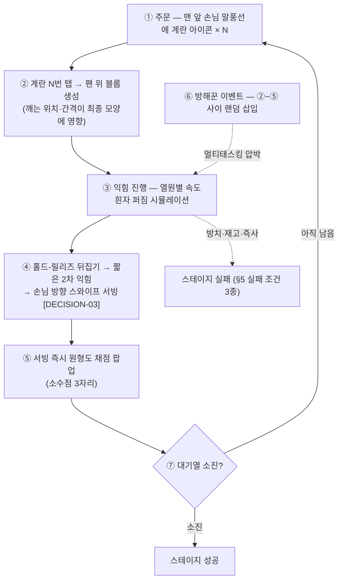

# 01 · 개요 — 컨셉·타깃·성능 예산

> EGG FLIP (가제)이 **무엇을 만드는 게임인지**, 누구를 위해 어떤 예산 안에서 만드는지, 그리고 v1에서 **만들지 않는 것**을 정의한다.
> 모든 규칙·수치의 원본은 [../GDD.md](../GDD.md)(SSOT)다. 이 문서는 그중 개요에 해당하는 §1·§2·§5·§6.4·§7·§10·§12·§15(및 §3·§13의 일부)를 엔지니어링 관점으로 정리한다.

---

## 1. 한 줄 컨셉 (GDD §1)

> 1인칭 계란후라이 아케이드. 손님 주문대로 계란을 깨서 굽고, 낚시 캐스팅식 파워 게이지로 팬을 뒤집고, 사방에서 난입하는 방해꾼을 몇 초 안에 **올바른 입력**으로 처리하면서, 최대한 완벽한 원에 가까운 후라이를 만든다. 점수는 원형도 기반 소수점 3자리(100.000점은 사실상 불가능).

- **레퍼런스 톤:** Bacon – the game (kamibox) — 미니멀하고 부드러운 손그림 느낌의 2D, 유머 있는 연출, 오브젝트 소수 정예.
- **유머 규약 (GDD §15):** 티배깅, 배틀그라운드 방탄팬 오마주, 별똥별 처치 같은 유머를 유지하되, 폭력은 **만화적 + 오프스크린**으로 처리한다(예: 거미 처치는 밟는 소리 SFX만, 비주얼 없음). IG 공유·스팀 **전연령**을 지향한다.
- **UI 텍스트 최소화:** 아이콘과 연출로 전달한다(Bacon 스타일).

---

## 2. 타깃 / 플랫폼 / 성능 예산 (GDD §2)

| 항목 | 내용 |
|---|---|
| 1차 타깃 | **모바일 웹 (세로 9:16)** + 데스크톱 웹 |
| 2차 타깃 | Capacitor(iOS/Android 앱), Electron + steamworks.js(Steam 무료 배포 + 스킨 MTX) — **M7, 현재는 문서화만** |
| 프레임 예산 | 미드레인지 안드로이드 크롬에서 **60fps** |
| 번들 예산 | 초기 로드 번들 **< 3MB** (에셋 lazy load) |
| 메모리 규율 | update 루프 내 **per-frame 객체 할당 금지**, 적/파티클/말풍선은 오브젝트 풀링, 텍스처는 아틀라스 |
| 입력 | **`pointerdown` 기준** (click의 지연 금지), 마우스 = 터치 동일 매핑 |
| 가로 화면(데스크톱) | 세로 액션 칼럼을 중앙 고정 + 좌우로 주방 배경 아트 확장(단순 레터박스 금지) — **[DECISION-05] 기본안, 미결** |

> [!NOTE]
> 성능 예산의 구현 전략(할당 0 패턴, 풀링·아틀라스 도입 시기, dt 클램프)은 [02-architecture.md](02-architecture.md)에서 다룬다.

---

## 3. 코어 루프 (GDD §5)

스테이지 내 루프는 7단계다. 방해꾼 이벤트(⑥)가 ②~⑤ 사이에 랜덤 삽입되어 멀티태스킹 압박을 만든다.

- **템포 원칙:** 전체 템포는 스피디하게 — 익힘은 짧고(스테이지 초반 기준 **8~15초/판**), 이벤트 전조는 짧고 명확하게.
- 서빙 방식(손님 방향 스와이프)은 **[DECISION-03] 기본안**이다(대안: 2차 익힘 완료 시 자동). 미결 목록은 [DECISIONS.md](DECISIONS.md) 참조.

---

## 4. 점수 철학 — 원형도 채점 (GDD §6.4)

점수는 "얼마나 완벽한 원인가"를 등주부등식 지수로 잰다.

- **Q = 4πA / P²** (완벽한 원 = 1.0)
- 구멍(총알): A_eff = A − ΣA_hole, P_eff = P + ΣP_hole → 자연 감점.
- 반토막(거미): 남은 폴리곤으로 그대로 계산 → 점수 폭락.
- `score = floor(Q_eff × 100 × 1000) / 1000` → **"97.412"** 형식 표기.
- **100.000은 도달 불가(의도된 설계).** 블롭이 노이즈 시뮬레이션으로 퍼지는 비정형 원이라 Q가 1.0에 닿지 않는다 — "완벽에 도전하되 닿을 수 없는" 점수 판타지가 코어 훅이다.
- 스테이지 점수 = 서빙 성공한 계란들의 **평균**(소수점 3자리). 주문 실패 손님의 계란은 미집계하고, 대신 별점을 감점한다(§10).

> [!NOTE]
> 이 함수는 유닛테스트 필수 대상이다(완벽 원·반토막·구멍 1~2개·융합 케이스 — GDD §6.4). 채점 구현은 M1 범위이며, 테스트 전략은 [04-testing.md](04-testing.md) 참조.

---

## 5. 실패 조건 3종과 별점 (GDD §5·§10)

즉시 실패는 아래 3종뿐이다. 그 외의 실수(주문 실패, 미스리드 오답 등)는 점수·별점 손해로 끝나고 스테이지는 계속 진행된다.

| # | 실패 조건 | 트리거 |
|---|---|---|
| 1 | **스프링클러 발동** | SMOKE 진입 후 3초 방치 → 검은 연기 → 스프링클러 연출 → 즉시 실패 |
| 2 | **계란 재고 부족** | 남은 재고 < 남은 주문 총량 판정 시 즉시 실패 ("마지막 손님 주문량 때문에 완료 불가" 상황) |
| 3 | **즉사형 이벤트** | 재채기 이벤트 방어 실패 → 침 튀김 → 후라이 오염 → 즉시 게임 오버. 즉사형은 재채기뿐이며, 그 외 미스리드 실패 페널티는 점수 손해 수준 — 그 강도는 [DECISION-06] 미결 |

**별점 (§10):** 스테이지 평균 점수를 `starThresholds`(예: `[80.0, 90.0, 96.0]` — 스테이지 데이터 값)와 비교해 별 1~3개를 준다. 주문 실패 손님이 있어도 별점만 감점될 뿐 스테이지는 계속된다.

---

## 6. 비목표 (v1에서 만들지 않는 것)

| 비목표 | 근거 |
|---|---|
| **손님 인내심 타이머 없음** | 시간 압박은 익힘 타이머와 방해꾼 이벤트에서 나온다 (GDD §7) |
| **결제는 스텁** | 스킨 상점의 결제는 버튼만 — 실 결제 연동 없음 (GDD §12) |
| **M7(앱/스팀 래핑)은 문서화만** | Capacitor·Electron+steamworks.js는 별도 승인 후 착수 (GDD §13) |
| **물리엔진 미사용** | 계란 블롭은 자체 간이 시뮬 — Graphics 폴리곤 + 스무딩 (GDD §3) |
| **외부 상태관리 라이브러리 금지** | 씬 로컬 상태 + 자체 경량 EventBus (GDD §3, [adr/0002](adr/0002-custom-eventbus-no-state-lib.md)) |

---

## 7. BM 스캐폴드 — 순수 코스메틱 계란 스킨 (GDD §12)

- 계란 스킨이 메인 BM이다. **순수 코스메틱** — 껍데기 색/무늬, 노른자 색, 깨질 때 이펙트 차등. **게임플레이 영향 0.**
- v1 범위: 스킨 데이터 스키마 + 상점 UI + 소유/장착 localStorage 저장까지. **결제는 스텁**(버튼만).

구현은 M5 범위다. 스키마 예시(껍데기 색/무늬·노른자 색·깨짐 이펙트·가격)는 [02-architecture.md](02-architecture.md) §5.3에 1벌만 둔다(원본 GDD §12).

---

## 관련 문서

- **문서 인덱스:** [docs/README.md](README.md)
- 프로젝트 컨텍스트: [../README.md](../README.md) · [../GDD.md](../GDD.md) · [../WORKPLAN.md](../WORKPLAN.md)
- 함께 읽기: [03-game-systems.md](03-game-systems.md) · [DECISIONS.md](DECISIONS.md) · [specs/M0-skeleton.md](specs/M0-skeleton.md)

| 이전 | 다음 |
|---|---|
| (처음 문서) | [02 아키텍처 →](02-architecture.md) |

---

최종 수정: 2026-07-07
