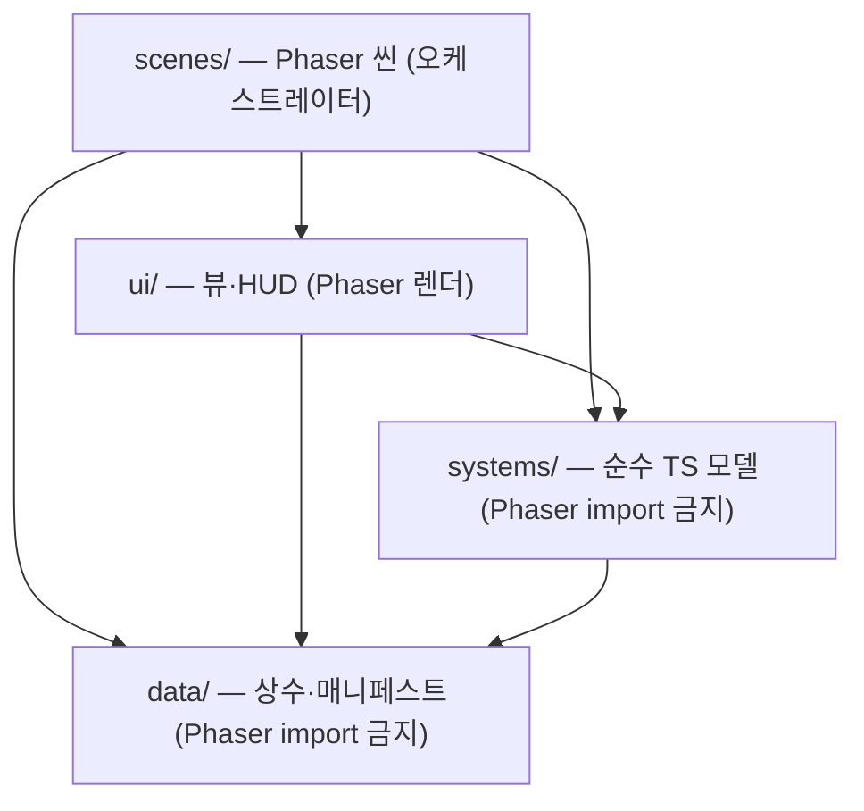

# 02 · 기술 아키텍처

> EGG FLIP (가제)의 기술 구조 — 스택, 씬 흐름, **순수 모델/뷰 분리**, EventBus, 데이터 주도 설계, 성능 전략.
> 원본 근거는 [../GDD.md](../GDD.md) §2·§3·§8·§10·§12와 [specs/M0-skeleton.md](specs/M0-skeleton.md)(상태: Approved)다. 구현은 `feat/m0-skeleton` 브랜치에서 진행된다.

---

## 1. 기술 스택 (GDD §3 — 고정, 변경 제안 금지)

| 영역 | 선택 | 비고 |
|---|---|---|
| 엔진/언어/빌드 | **Phaser 3 최신 안정판 + TypeScript(strict) + Vite** | [adr/0001](adr/0001-tech-stack-phaser-vite-ts.md) |
| 상태 관리 | 씬 로컬 상태 + **자체 경량 EventBus** | 외부 상태관리 라이브러리 금지 — [adr/0002](adr/0002-custom-eventbus-no-state-lib.md) |
| 계란 블롭 렌더 | `Phaser.GameObjects.Graphics` 폴리곤 + 스무딩 | **물리엔진 미사용** (자체 간이 시뮬) |
| 저장 | localStorage 래퍼 (schema version 필드 포함) | 진행도/스킨 — §9 참조 |
| 공유 | 오프스크린 Canvas 합성 → PNG → Web Share API | 미지원 시 다운로드 + 클립보드 — §9 참조 |
| 테스트 / 린트 | Vitest / eslint + prettier 기본 설정 | 순수 로직만 테스트 — [04-testing.md](04-testing.md) |
| 배포 | 정적 빌드, vite `base` 유연하게 | Vercel / GitHub Pages / itch.io 겨냥 |

---

## 2. 씬 구조


| 씬 | 책임 (M0 스펙 기준, 예정) |
|---|---|
| **BootScene** | 최소 초기화 후 Preload로 전환 |
| **PreloadScene** | `data/assets.ts` 에셋 키 매니페스트 순회 로더 — M0에서는 빈 배열로 파이프만 증명, 최종 아트 교체 시 키만 스프라이트로 스왑 (GDD §14) |
| **GameScene** | 오케스트레이터 — `pointerdown` 배선, dt 클램프, 순수 모델 tick → EventBus 발행 → 뷰 갱신. 게임 규칙을 직접 들고 있지 않는다 |
| **ResultScene** | M0에서는 스텁(디버그 버튼으로만 진입). 결과 화면 본편(후라이 배열·카운트업·별점·PNG 공유)은 M3 |

---

## 3. 순수 모델/뷰 분리 — 이 아키텍처의 제1원칙

게임 규칙(익힘 FSM, 블롭 시뮬, 채점, 이벤트 스케줄러)은 **Phaser를 모르는 순수 TS**로 작성한다.

- **`src/systems/`와 `src/data/`는 Phaser import 금지.** 이 경계는 eslint `no-restricted-imports` 규칙으로 **기계 강제**한다 — 리뷰어의 눈이 아니라 린트가 지킨다.
- 의존 방향은 단방향이다:



- **왜:** Vitest가 **node 환경**에서 canvas mock 없이 돈다. GDD가 요구하는 "유닛테스트는 순수 로직(채점, 익힘 모델, 뒤집기 판정, 이벤트 스케줄러)에만"이 이 경계 위에서 성립한다 — M1 채점·뒤집기 판정 테스트의 전제.
- 시간은 전부 dt 주입, 난수는 전부 시드 기반 — 동일 시드·동일 dt 시퀀스 = 동일 결과(결정론, M0 스펙 설계 원칙).

---

## 4. EventBus 설계 ([adr/0002](adr/0002-custom-eventbus-no-state-lib.md))

외부 상태관리 라이브러리 대신 **자체 typed pub/sub** 하나를 쓴다. `systems/EventBus.ts`(on/off/emit, emit 중 off 안전) + `systems/events.ts`(이벤트 이름/페이로드 타입 사전).

- **네이밍 규약: `domain:action`.** 이벤트 이름과 페이로드 타입은 `events.ts`의 `interface GameEvents`에서만 정의한다.
- **M0 이벤트 3종:** `egg:cracked`(계란 깨짐 — pointerdown → 블롭 생성) · `cook:stateChanged`(익힘 FSM 상태 전이) · `cook:smokeCritical`(SMOKE 진입 후 유예 시간 경과, 정확히 1회 발행).
- **향후 도메인 예약:** `flip:*`(M1) / `serve:*`(M1) / `enemy:*`(M2+) / `stage:*`(M3+)는 주석으로만 예약하고 코드·타입은 선작성하지 않는다(YAGNI).
- **씬 shutdown 규약:** 씬이 등록한 리스너는 씬 `shutdown` 시 반드시 해제한다 — 씬 재시작 시 중복 구독·유령 리스너 방지. 이 규약은 [05-conventions.md](05-conventions.md)에도 명시한다.

---

## 5. 데이터 주도 설계 — "새 적 = JSON 항목 + 핸들러 1개"

콘텐츠(적·스테이지·스킨)는 코드가 아니라 데이터로 늘린다. 스키마 3종은 GDD가 예시로 고정했고, 각각 해당 마일스톤에서 정식 정의된다.

### 5.1 방해꾼 이벤트 스키마 (GDD §8 — M2에서 정의)

> **새 적 추가가 "JSON 항목 + 핸들러 1개 등록"만으로 가능해야 한다.** (GDD §8)

```jsonc
{
  "id": "ninja_spider",
  "stageUnlock": 2,
  "telegraphMs": 900,          // 전조 연출 시간
  "responseWindowMs": 1800,    // 대응 입력 허용 시간
  "input": "drag_cut",         // 입력 핸들러 키
  "cooldownMs": [8000, 15000],
  "maxConcurrent": 1,
  "onSuccess": ["fx_web_flutter", "sfx_stomp_offscreen"],
  "onFail": ["egg_bisect", "actor_escape"]
}
```

이벤트 스케줄러는 조리 중에만 발생시키고 스테이지별 `eventBudget` 소진까지 랜덤 간격으로 삽입한다. 오답 아이템(decoy)도 스키마에 포함된다: `{"id": "shield_decoy", "correctFor": null, "failGag": "handle_falls_off"}` (GDD §9). 지역 확장 적(§8 ⑧)은 더미 JSON 1개로 스키마 수용성만 증명한다.

### 5.2 스테이지 스키마 (GDD §10 — M3에서 정의)

```jsonc
{
  "id": "stage_04",
  "background": "kitchen_day",
  "heatSource": "campfire",
  "customers": 6,
  "orderRange": [1, 3],
  "panCapacity": 2,              // 팬 동시 계란 수 [DECISION-07 미결]
  "eggStock": 14,
  "enemyPool": ["ninja_spider", "back_robber", "fly"],
  "eventBudget": 5,
  "items": [
    {"id": "lid", "pos": "wall_left"},
    {"id": "fencing_sword", "pos": "stove_side"},
    {"id": "shield_decoy", "pos": "stove_side"}
  ],
  "starThresholds": [80.0, 90.0, 96.0]   // 평균 점수 기준 별 1~3
}
```

### 5.3 스킨 스키마 (GDD §12 — M5에서 정의)

```jsonc
{"id": "egg_galaxy", "shell": "#2b1d4e", "pattern": "stars", "yolk": "#ffd34d", "crackFx": "sparkle", "price": 0}
```

순수 코스메틱 — 게임플레이 영향 0. BM 맥락은 [01-overview.md](01-overview.md) §7 참조.

---

## 6. 디렉터리 구조 (M0 스펙 기준 — 예정)

아래 트리는 [specs/M0-skeleton.md](specs/M0-skeleton.md)(Proposed)의 계획이다. 문서 구조는 [adr/0003](adr/0003-sdd-document-structure.md)을 따른다.

```
happyeggs/
├─ index.html            # 세로 뷰포트 메타, touch-action:none, 100dvh
├─ vite/vitest/eslint 설정  # base './' · node 테스트 환경 · 모델/뷰 경계 강제 (§3)
└─ src/
   ├─ main.ts            # Phaser.Game 부트스트랩 (FIT + autoCenter, 논리 해상도 720×1280 — ADR-0004)
   ├─ scenes/            # Boot / Preload / Game / Result
   ├─ systems/           # ★ 순수 TS — EventBus, events, noise, CookingModel, EggBlobModel
   ├─ ui/                # views/(PanView, HandsView, EggView) + DebugHud
   └─ data/              # balance / assets / palette / layout
```

### 데이터 파일 4종의 역할

| 파일 | 역할 |
|---|---|
| `data/balance.ts` | **게임플레이 튜닝 수치 전부** — 익힘 임계, 열원 계수, 정점 수 등. 매직넘버 인라인 금지(GDD §0) |
| `data/assets.ts` | 에셋 키 매니페스트 — M0는 빈 목록 + 타입, 최종 아트 교체 시 키만 스왑 (GDD §14) |
| `data/palette.ts` | placeholder 5색 + 익힘 상태별 색 |
| `data/layout.ts` | 논리 해상도 + 중앙 액션 칼럼 기준 배치 비율 ([DECISION-05] 대비) |

> [!NOTE]
> "밸런스는 balance.ts 한 파일" 규약의 해석 — **튜닝 수치만 balance.ts, 색은 palette.ts·좌표는 layout.ts 분리**로 확정되었다 ([adr/0008](adr/0008-balance-file-scope.md), 원 항목 M0-5).

---

## 7. 성능 전략 (GDD §2 예산의 구현)

| 예산/규칙 | 구현 전략 | 시기 |
|---|---|---|
| per-frame 객체 할당 금지 → 60fps | 모델은 정점 배열 **in-place 갱신**, 뷰는 `Point[]` **사전 할당** 후 x/y만 mutate. 폰 실측 60fps 확인은 M6 성능 패스 | M0부터 |
| 오브젝트 풀링 | 적/파티클/말풍선 — 등장하는 M2부터 도입(M0 선작성 금지) | M2+ |
| 텍스처 아틀라스 | 최종 아트 전환 시 | M6 |
| dt 클램프 | 탭 이탈 복귀 시 거대 dt로 계란 즉사(전소) 방지 — **0.1초 ([adr/0006](adr/0006-dt-clamp-background.md))** | M0 |
| HUD 스로틀 | 디버그 HUD 텍스트 갱신 250ms 간격 — 매 프레임 텍스트 재조립 방지 | M0 |
| 초기 번들 < 3MB | 에셋 lazy load, 정적 빌드 | 상시 |
| 입력 지연 | `pointerdown` 기준(click 금지), 마우스=터치 동일 매핑 | M0부터 |

---

## 8. 저장·공유 (설계만 — 구현은 M3/M5)

- **저장:** localStorage 래퍼에 **schema version 필드**를 포함해 마이그레이션 여지를 남긴다(GDD §3). 스테이지 진행도는 M3, 스킨 소유/장착은 M5에서 사용한다. M0에는 불필요하여 연기(M0 스펙 경계 명시).
- **공유:** 결과 화면을 **오프스크린 Canvas로 합성 → PNG** → 모바일 Web Share API(미지원 시 다운로드 + 클립보드). 파일명 규칙 `eggflip_stage04_92.317.png` (GDD §11). 구현은 M3.

---

## 9. 관련 ADR

- [adr/0001-tech-stack-phaser-vite-ts.md](adr/0001-tech-stack-phaser-vite-ts.md) — 기술 스택: Phaser 3 + TS(strict) + Vite
- [adr/0002-custom-eventbus-no-state-lib.md](adr/0002-custom-eventbus-no-state-lib.md) — 자체 EventBus, 외부 상태관리 라이브러리 금지
- [adr/0003-sdd-document-structure.md](adr/0003-sdd-document-structure.md) — SDD 문서 구조 (인덱스: [adr/README.md](adr/README.md))

---

## 관련 문서

- **문서 인덱스:** [docs/README.md](README.md)
- 프로젝트 컨텍스트: [../GDD.md](../GDD.md) · [../CLAUDE.md](../CLAUDE.md) · [../WORKPLAN.md](../WORKPLAN.md)
- 함께 읽기: [03-game-systems.md](03-game-systems.md) · [04-testing.md](04-testing.md) · [specs/M0-skeleton.md](specs/M0-skeleton.md) · [DECISIONS.md](DECISIONS.md)

| 이전 | 다음 |
|---|---|
| [← 01 개요](01-overview.md) | [03 게임 시스템 →](03-game-systems.md) |

---

최종 수정: 2026-07-07
