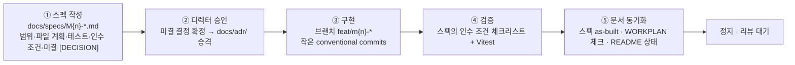

# 05 개발 규약·기여 가이드

> EGG FLIP (가제)의 브랜치·커밋·코드·에셋 규약과 SDD 프로세스 준수 방법을 정의한다.
> [../CLAUDE.md](../CLAUDE.md)의 ⛔ 절대 규칙을 사람·에이전트 모두가 따를 수 있게 풀어 쓴 것이며, 충돌 시 CLAUDE.md와 SSOT인 [GDD.md](../GDD.md)가 우선한다.

> [!NOTE]
> **현재 상태**
> 코드 0줄, 문서 단계다. 아래의 소스 경로(`src/…`)와 명령은 M0 스펙([specs/M0-skeleton.md](specs/M0-skeleton.md), 상태: Proposed)의 계획이며 전부 **예정**이다.

---

## 1. 브랜치 전략

| 브랜치 | 용도 |
|---|---|
| `main` | 문서·통합. 마일스톤 완료분이 리뷰 후 합류 |
| `feat/m{n}-<이름>` | 마일스톤 구현 브랜치. 예: `feat/m0-skeleton` |

- 마일스톤 = 브랜치 1개. 마일스톤을 건너뛰거나 병합하지 않는다(GDD §13 순서 고정).
- 구현 착수는 해당 스펙이 **Approved**가 된 뒤에만 한다(§6 마일스톤 게이트).

## 2. 커밋 규약

**conventional commits**를 쓴다: `feat:` `fix:` `refactor:` `docs:` `chore:` `test:`. 커밋은 작게 — 의미 단위 1개 — 그리고 **각 커밋 시점에 빌드·테스트가 그린**이어야 한다(구현 단계부터 적용).

| 예시 | 용도 |
|---|---|
| `chore: scaffold vite + phaser3 + ts(strict) + vitest + eslint/prettier` | 프로젝트 셋업 |
| `feat: add cooking fsm model` | 기능 1개 (+co-locate 테스트 동반) |
| `feat: crack eggs on pointerdown and render spreading blobs` | 배선·렌더 단위 |
| `fix: clamp dt on tab return` | 버그 수정 |
| `docs: add 05-conventions` | 문서 |
| `test: add dt split invariance case` | 테스트 보강 |

> [!TIP]
> **커밋 순서까지 스펙에 있다**
> M0의 커밋 12개는 스펙 §7에 순서대로 계획돼 있다. "상수 홈(balance.ts) 먼저 → 매직넘버 원천 차단" 같은 순서 의도가 있으니 임의로 섞지 않는다.

## 3. 코드 규약

- **TypeScript strict**. eslint + prettier **기본 설정**(커스텀 룰 최소).
- 코드·식별자는 **영어**, 주석·문서는 **한국어 허용**(GDD §0).
- **순수 존(`src/systems/`·`src/data/`)은 Phaser import 금지.** eslint `no-restricted-imports`로 기계 강제한다 — Vitest node 환경(canvas mock 불필요)의 전제. 경계 정의는 [02-architecture.md](02-architecture.md).
- update 루프 내 per-frame 객체 할당 금지, 입력은 `pointerdown` 기준 — 성능 규약은 [01-overview.md](01-overview.md).

## 4. balance.ts 규약

- 밸런스 수치(시간, 계수, 판정 윈도우, 감점량)는 **전부 `src/data/balance.ts` 한 파일**에 상수로 둔다. **매직넘버 인라인 금지**(GDD §0).
- 상수 객체는 `as const`로 선언해 리터럴 타입을 고정한다.
- 튜닝은 balance.ts 수정만으로 끝나야 한다 — 수치를 바꾸려고 시스템 코드를 여는 순간 규약 위반이다.

> [!WARNING]
> **"한 파일"의 해석 범위는 미결 (M0-5)**
> 기본안은 **게임플레이 튜닝 수치만 balance.ts, 색은 palette.ts·좌표는 layout.ts 분리**(M5 스킨/열화상 대비)이지만 아직 디렉터 승인 전이다 — [DECISIONS.md](DECISIONS.md).

## 5. 에셋 규약

- 지금은 **전부 placeholder programmer art**: Graphics 도형 + 제한 팔레트 5색(GDD §14).
- 단, 최종 아트 교체를 전제로 **에셋 키 매니페스트 `src/data/assets.ts`를 처음부터 유지**한다 — 나중에 키만 스프라이트로 스왑. M0에서는 빈 목록 + 타입으로 파이프만 증명.
- SFX는 **무음 스텁 훅**만 연결한다(GDD §14 리스트). 훅 없이 연출만 만드는 것도, 실제 음원을 넣는 것도 현 단계 범위 밖.

## 6. 마일스톤 게이트 — SDD 루프

모든 마일스톤은 아래 루프를 돈다. **스펙 승인 전 구현 금지, 완료 시 정지·리뷰 대기**(GDD §0)가 게이트다.

- 스펙 상태는 **Proposed → Approved → Implemented → Verified** 순으로만 전진한다. 프로세스·템플릿은 [specs/README.md](specs/README.md).
- 구현 중 스펙에 없는 판단이 필요해지면 임의 결정하지 말고 §7의 [DECISION] 프로세스를 태운다.

## 7. [DECISION] 프로세스

GDD 첫머리 규약: 문서와 충돌하거나 문서에 없는 판단은 **임의로 결정하지 않는다**.

1. 미결 발생 → [DECISIONS.md](DECISIONS.md)에 `[DECISION]` 항목 추가(맥락·선택지·기본안·트레이드오프 1~2줄).
2. 디렉터에게 질문 — 답이 나올 때까지 해당 결정에 의존하는 구현은 보류(기본안 가정 구현 금지).
3. 확정 시 [docs/adr/](adr/README.md)에 **ADR로 승격**(번호 부여) + DECISIONS.md의 해당 항목 상태 갱신(확정·ADR 링크).

> [!IMPORTANT]
> **확인 필요: 현재 미결 전부 열려 있음**
> GDD §16의 DECISION-01~07과 M0 스펙의 M0-1~5는 **전부 미결**이며 기본안만 있다. 어느 문서에서든 확정된 것처럼 쓰지 않는다.

## 8. 문서 동기화 (SDD 루프 ⑤)

구현이 끝난 마일스톤은 문서를 코드 실물에 맞춘다.

| 대상 | 갱신 내용 |
|---|---|
| `docs/specs/M{n}-*.md` | **as-built** 갱신 — 계획과 달라진 부분 명기, 상태 전진 |
| [../WORKPLAN.md](../WORKPLAN.md) | 해당 마일스톤 DoD 체크 |
| [../README.md](../README.md) | 프로젝트 상태(현재 마일스톤·스펙 상태) 갱신 |

문서가 코드와 어긋난 채로 다음 마일스톤을 시작하지 않는다 — SSOT 체계(GDD → 스펙 → 코드)의 유지 비용이 여기서 결정된다.

---

## 관련 문서

- 문서 인덱스: [docs/README.md](README.md)
- 이전: [04 테스트 전략](04-testing.md)
- 함께 보기: [작업 규칙 — ../CLAUDE.md](../CLAUDE.md) · [SDD 프로세스](specs/README.md) · [미결 결정 로그](DECISIONS.md) · [ADR 인덱스](adr/README.md) · [WORKPLAN](../WORKPLAN.md)

---

최종 수정: 2026-07-07
