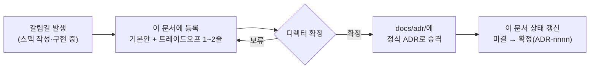

# [DECISION] 미결 결정 로그

> "EGG FLIP (가제)"의 **미결 [DECISION] 단일 로그**다. GDD §0 규약 — "이 문서(GDD)와 충돌하거나 문서에 없는 판단이 필요하면 **임의로 결정하지 말 것**" — 을 지탱한다.
> 항목이 확정되면 [docs/adr/](adr/README.md)로 승격하고 이 문서의 상태를 갱신한다. SSOT는 [../GDD.md](../GDD.md)다.

## 운영 방식

- 등록 시 반드시 **기본안(추천)** 과 **트레이드오프 1~2줄**을 함께 적는다 (GDD §0: "선택지가 갈리는 지점은 트레이드오프를 1~2줄로 요약").
- 기본안이 있어도 **확정 전에는 확정된 것처럼 구현·문서화하지 않는다.**
- 확정된 결정의 본문(맥락·근거·대안·결과)은 [adr/README.md](adr/README.md)의 6절 형식을 따른다.

> [!WARNING]
> 표 1(DECISION-01~07)은 **미결**이다 — 기본안은 제안일 뿐, 디렉터 승인 없이 구현에 반영할 수 없다.
> 표 2(M0-1~5)는 **2026-07-07 M0 스펙 승인과 함께 기본안으로 일괄 확정**되어 ADR-0004~0008로 승격되었다.

## 표 1 — 게임 디자인 결정 (GDD §16 이관: DECISION-01~07 + 구현 파생 08)

GDD §16 미결 목록의 이관이다. 원문·기본안의 진실 소스는 [../GDD.md](../GDD.md) §16이다.

| # | 항목 | 기본안 | 상태 |
|---|---|---|---|
| DECISION-01 | 재채기 대응 (GDD §8.1 ③) | 팬 뚜껑 탭 (대안: 티슈 건네기) | **확정**(기본안) — [M4 스펙 §4](specs/M4-enemies-items.md) |
| DECISION-02 | 머리카락 대응 (GDD §8.1 ④) | 토치 공중 소각 (대안: 뒤집개 스와이프 쳐내기 / 핀셋 캐치) | **확정**(기본안) — [M4 스펙 §4](specs/M4-enemies-items.md) |
| DECISION-03 | 서빙 방식 (GDD §4·§5) | 손님 방향 스와이프 (대안: 2차 익힘 완료 시 자동) | **확정**(기본안) — [M1 스펙 §10](specs/M1-core-loop.md) |
| DECISION-04 | 저격수 증식 트리거 (GDD §8.1 ⑤) | 저격수/레이저 직접 탭 시 +1 (최대 3) | **확정**(기본안) — [M4 스펙 §4](specs/M4-enemies-items.md) |
| DECISION-05 | 가로 화면 정책 (GDD §2) | 중앙 액션 칼럼 + 좌우 배경 확장 | 미결(기본안 제시) |
| DECISION-06 | 미스리드 실패 페널티 (GDD §9) | 점수 손해 (즉사 아님) | **확정**(기본안) — [M4 스펙 §4](specs/M4-enemies-items.md) |
| DECISION-07 | 팬 동시 계란 수 (GDD §10) | 스테이지별 1~3 | **확정**(기본안) — [M3 스펙](specs/M3-stage-system.md) |
| DECISION-08 | 저격수 총알 구멍 감점 (GDD §8.1 ⑤ "채점 반영" — 수치 미명시) | 구멍 1개당 **−12.000점** (증식 수만큼 누적) | 미결(기본안 제시, M4 구현 반영) |
| DECISION-09 | 코인 경제 도입 (GDD §12 BM 재화 미정의) | 서빙 계란당 기본 2 + 팁(95+→4/85+→2/70+→1), 클리어 무관 적립, 저장 v2 | **확정** — 디렉터 GPGP 레퍼런스 지시, [ADR-0011](adr/0011-gpgp-customer-loop-and-coins.md) |
| DECISION-10 | 흰자 드리프트 + 뒤집개 밀기 (GDD §6.1 코어 확장) | 흰자가 흘러 불룩해지고 가장자리 탭으로 모은다 — 원형도가 스킬이 됨. 과밀기 움푹 페널티 | **확정** — 디렉터 제안(2026-07-09), [ADR-0012](adr/0012-drift-and-spatula-herding.md) |

## 표 2 — 엔지니어링 미결 (M0 스펙 제기: M0-1~5)

[specs/M0-skeleton.md](specs/M0-skeleton.md) 작성 중 제기된 항목으로, **2026-07-07 M0 스펙 승인과 함께 전부 기본안으로 확정**되었다.

| # | 항목 | 기본안(추천) | 트레이드오프 | 상태 |
|---|---|---|---|---|
| M0-1 | 논리 해상도 | **720×1280** | 540×960은 미드레인지 성능 여유 ↔ 720은 고DPI 선명도 + M3 PNG 공유·M5 셰이더 품질에 유리. placeholder 부하(계란 ≤3 × 48정점)는 어느 쪽도 미미 | **확정** — [ADR-0004](adr/0004-logical-resolution-720x1280.md) |
| M0-2 | SMOKE→스프링클러 3초의 시계 기준 | **실시간(dt 누적)** | 불 꺼도 연기는 계속(직관적) ↔ 열원 연동은 모델 일관성. M5 "불 끄기" 규칙에 직결 | **확정** — [ADR-0005](adr/0005-smoke-timer-realtime.md) |
| M0-3 | 백그라운드(탭 이탈) 복귀 처리 | **dt 클램프 0.1초 → 사실상 익힘 정지** | 클램프 없으면 복귀 순간 계란 즉사(전소). 이탈 시간만큼 진행시키는 대안은 비추천 | **확정** — [ADR-0006](adr/0006-dt-clamp-background.md) |
| M0-4 | 노이즈 구현 | **자체 1D 밸류 노이즈** | GDD 표기는 "Perlin"이나 시각 결과 동등 + 의존성 0 + 시드 결정성. 부족하면 M6에서 교체(인터페이스 동일) | **확정** — [ADR-0007](adr/0007-value-noise-over-perlin.md) |
| M0-5 | "밸런스는 balance.ts 한 파일" 해석 | **게임플레이 튜닝 수치만 balance.ts, 색은 palette.ts·좌표는 layout.ts** | 문면대로 한 파일이면 M5 스킨/열화상 때 팔레트 교체가 지저분해짐 | **확정** — [ADR-0008](adr/0008-balance-file-scope.md) |

## 확정 이력

| 승격일 | 원 항목 | ADR | 비고 |
|---|---|---|---|
| 2026-07-07 | M0-1 논리 해상도 | [ADR-0004](adr/0004-logical-resolution-720x1280.md) | 720×1280 |
| 2026-07-07 | M0-2 SMOKE 유예 시계 | [ADR-0005](adr/0005-smoke-timer-realtime.md) | 실시간(dt 누적) |
| 2026-07-07 | M0-3 백그라운드 복귀 | [ADR-0006](adr/0006-dt-clamp-background.md) | dt 클램프 0.1초 |
| 2026-07-07 | M0-4 노이즈 구현 | [ADR-0007](adr/0007-value-noise-over-perlin.md) | 자체 1D 밸류 노이즈 |
| 2026-07-07 | M0-5 balance.ts 범위 | [ADR-0008](adr/0008-balance-file-scope.md) | 튜닝 수치만(색·좌표 분리) |

디렉터가 M0 스펙을 승인하며 M0-1~5 기본안을 일괄 채택했다(SDD 루프 ②).

> [!NOTE]
> 기존 ADR [0001](adr/0001-tech-stack-phaser-vite-ts.md)·[0002](adr/0002-custom-eventbus-no-state-lib.md)·[0003](adr/0003-sdd-document-structure.md)은 이 로그의 미결이 확정된 것이 **아니다**. 0001·0002는 GDD §3(고정 — 변경 제안 금지), 0003은 2026-07-07 디렉터 지시로 **이미 확정되어 있던 사항을 ADR 형식으로 기록**한 것이다.

---

## 관련 문서

- 문서 인덱스: [README.md](README.md) · SSOT: [../GDD.md](../GDD.md) §16
- 확정 기록: [adr/README.md](adr/README.md) — ADR 인덱스
- 미결 발생 지점: [specs/M0-skeleton.md](specs/M0-skeleton.md) (M0-1~5) · SDD 프로세스: [specs/README.md](specs/README.md)

최종 수정: 2026-07-08 (M4 — DECISION-01·02·04·06 확정(기본안), 08 신규)
