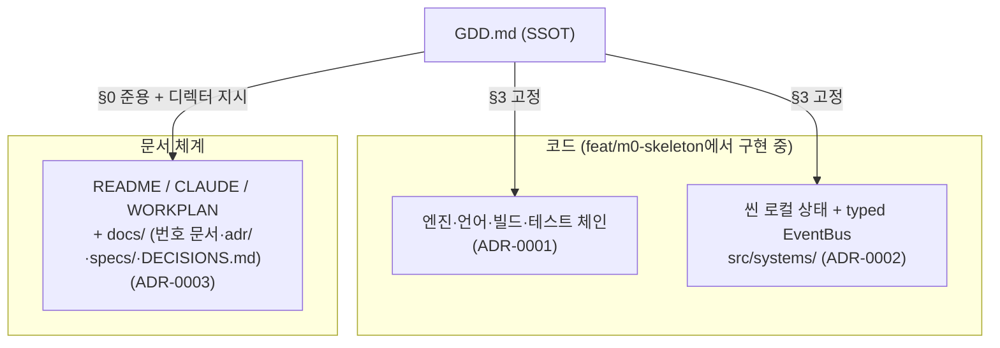

# ADR 인덱스 — 아키텍처 결정 기록

> "EGG FLIP (가제)" 프로젝트의 주요 설계 결정을 한 곳에 모은 목록이다.
> "왜 이렇게 만들었는가"를 나중에도 추적할 수 있도록, 결정이 내려진 맥락과 함께 기록한다.

## ADR이란

**ADR(Architecture Decision Record)** 은 프로젝트에서 내린 **하나의 중요한 아키텍처 결정**을, 그 결정이 내려진 **맥락·근거·대안·결과와 함께 짧게 기록**한 문서다. "왜 물리엔진을 안 쓰지?", "왜 상태관리 라이브러리가 없지?" 같은 질문에 대한 답을, 코드 주석이나 누군가의 기억이 아니라 **버전 관리되는 문서**로 남긴다.

ADR의 핵심 원칙:

- **하나의 ADR = 하나의 결정.** 여러 결정을 한 문서에 섞지 않는다.
- **불변 기록.** 한번 채택된 ADR의 본문은 바꾸지 않는다. 결정이 바뀌면 새 ADR을 추가하고 기존 ADR을 `폐기됨(Superseded)` 상태로 표시한다.
- **결과까지 적는다.** 결정이 가져온 트레이드오프(좋아진 점·감수한 점)를 솔직하게 남긴다.

## 이 프로젝트의 ADR 형식 (6절)

각 ADR은 아래 항목을 갖춘다. **상태(Status)는 머리말 표에 기재**하는 것을 기본으로 하며, 나머지 5개 절은 모든 ADR이 본문에 갖춘다.

| 절 | 내용 |
|---|---|
| **상태(Status)** | `채택(Accepted)` / `제안(Proposed)` / `폐기됨(Superseded)` / `폐기(Deprecated)` — 머리말 표에 기재 |
| **맥락(Context)** | 이 결정을 강제한 상황·제약 (모바일 웹 60fps, 번들 < 3MB, GDD 고정 사항 등) |
| **결정(Decision)** | 우리가 무엇을 하기로 했는가 (한두 문장으로 단정적으로) |
| **근거(Rationale)** | 그렇게 결정한 이유 |
| **대안(Alternatives)** | 검토했으나 채택하지 않은 선택지와 그 이유 |
| **결과(Consequences)** | 이 결정으로 생기는 좋은 점·감수할 점·후속 작업 |

## ADR 목록

| 번호 | 제목 | 상태 | 링크 |
|---|---|---|---|
| 0001 | 기술 스택: Phaser 3 + TypeScript(strict) + Vite | 채택 | [0001-tech-stack-phaser-vite-ts.md](0001-tech-stack-phaser-vite-ts.md) |
| 0002 | 자체 경량 EventBus — 외부 상태관리 라이브러리 금지 | 채택 | [0002-custom-eventbus-no-state-lib.md](0002-custom-eventbus-no-state-lib.md) |
| 0003 | SDD 문서 체계 채택 (KEIAdminSuperv 구조 준용) | 채택 | [0003-sdd-document-structure.md](0003-sdd-document-structure.md) |
| 0004 | 논리 해상도 720×1280 | 채택 | [0004-logical-resolution-720x1280.md](0004-logical-resolution-720x1280.md) |
| 0005 | SMOKE→스프링클러 유예는 실시간 기준 | 채택 | [0005-smoke-timer-realtime.md](0005-smoke-timer-realtime.md) |
| 0006 | dt 클램프 0.1초 (백그라운드 = 익힘 정지) | 채택 | [0006-dt-clamp-background.md](0006-dt-clamp-background.md) |
| 0007 | 블롭 노이즈는 자체 1D 밸류 노이즈 | 채택 | [0007-value-noise-over-perlin.md](0007-value-noise-over-perlin.md) |
| 0008 | balance.ts 범위: 게임플레이 튜닝 수치만 | 채택 | [0008-balance-file-scope.md](0008-balance-file-scope.md) |
| 0009 | Bacon 톤 절차적 아트 + v1까지 연속 개발 | 채택 | [0009-procedural-bacon-art-and-continuous-dev.md](0009-procedural-bacon-art-and-continuous-dev.md) |
| 0010 | 다이제틱 주방 무대 + 무자막 조작 힌트 | 채택 | [0010-diegetic-kitchen-scene.md](0010-diegetic-kitchen-scene.md) |
| 0011 | GPGP식 손님 중심 루프 + 코인 경제 | 채택 | [0011-gpgp-customer-loop-and-coins.md](0011-gpgp-customer-loop-and-coins.md) |
| 0012 | 흰자 드리프트 + 뒤집개로 모으기 (코어 스킬) | 채택 | [0012-drift-and-spatula-herding.md](0012-drift-and-spatula-herding.md) |

> [!NOTE]
> 세 ADR 모두 **이미 확정되어 있던 사항의 기록**이다 — 0001·0002는 [GDD](../../GDD.md) §3(고정, 변경 제안 금지)이, 0003은 2026-07-07 디렉터 지시가 결정 주체이며, [../DECISIONS.md](../DECISIONS.md)의 미결 항목이 승격된 것이 아니다. 미결 항목의 승격분은 0004부터다 — **0004~0008이 M0-1~5의 승격분**(2026-07-07, M0 스펙 승인 시 기본안 일괄 채택)이며, DECISION-01~07은 아직 미결이다.

각 결정이 영향을 주는 영역을 한눈에 보면 다음과 같다.

## 새 ADR을 추가하려면

1. 다음 번호(`0009-…`)로 파일을 만들고 위 6절 형식을 따른다.
2. 위 **ADR 목록** 표에 한 줄 추가한다.
3. 기존 결정을 대체하는 경우, 대체되는 ADR의 상태를 `폐기됨(Superseded by nnnn)`으로 바꾸고 본문 상단에서 새 ADR로 링크한다(본문 내용 자체는 보존).
4. 작은 단위로 커밋한다(conventional commits, `docs:` 접두).

## docs/DECISIONS.md(미결)와의 관계

결정 기록은 두 문서로 이원화되어 있다 (근거: [ADR-0003](0003-sdd-document-structure.md)).

| 문서 | 담는 것 | 성격 |
|---|---|---|
| [../DECISIONS.md](../DECISIONS.md) | **미결** [DECISION] — 기본안 + 트레이드오프만 있고 아직 확정되지 않은 항목 | 유동 (수시 갱신) |
| `docs/adr/` (이 디렉터리) | **확정**된 결정 — 맥락·근거·대안·결과 포함 | 불변 (본문 고정) |

미결 항목이 디렉터 승인으로 확정되면 새 ADR로 승격하고, DECISIONS.md의 해당 행을 `확정(ADR-nnnn)`으로 갱신한다. 승인 게이트의 위치(SDD 루프 ②)는 [../specs/README.md](../specs/README.md)를 참고한다.

---

## 관련 문서

- 문서 인덱스: [../README.md](../README.md) · SSOT: [../../GDD.md](../../GDD.md)
- 미결 로그: [../DECISIONS.md](../DECISIONS.md) · 아키텍처: [../02-architecture.md](../02-architecture.md)
- 다음(첫 ADR): [0001-tech-stack-phaser-vite-ts.md](0001-tech-stack-phaser-vite-ts.md)

최종 수정: 2026-07-07
