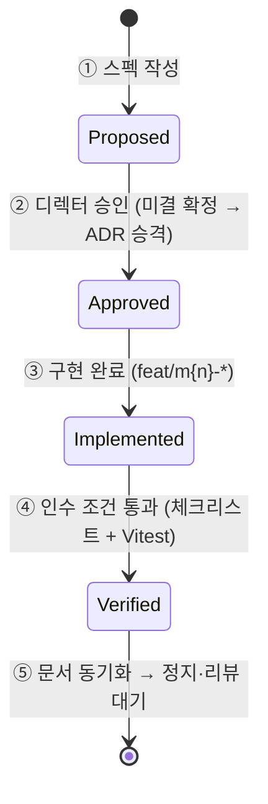

# 스펙 (Specs) — SDD 프로세스와 템플릿

> "EGG FLIP (가제)"는 **SDD(Spec Driven Development)** 로 개발한다 — **스펙이 구현에 앞선다.**
> **마일스톤 1개 = 스펙 문서 1개.** 디렉터 승인 없이는 구현에 착수하지 않는다 ([GDD](../../GDD.md) §0·§13).

## SDD 루프

모든 마일스톤은 아래 5단계를 동일하게 밟고, 마지막에 **정지·리뷰 대기**한다.

| 단계 | 내용 | 산출물 |
|---|---|---|
| ① 스펙 작성 | `docs/specs/M{n}-*.md` — 범위·파일 계획·테스트·인수 조건·미결 [DECISION] | 스펙 (상태 `Proposed`) |
| ② 디렉터 승인 | 미결 결정 확정 → [../adr/](../adr/README.md) 승격, [../DECISIONS.md](../DECISIONS.md) 상태 갱신 | 스펙 `Approved` + 새 ADR |
| ③ 구현 | 브랜치 `feat/m{n}-*`, 작은 conventional commits | 코드 + 그린 테스트 → 스펙 `Implemented` |
| ④ 검증 | 스펙의 인수 조건 체크리스트 + Vitest | 인수 조건 전체 통과 → 스펙 `Verified` |
| ⑤ 문서 동기화 | 스펙 as-built 갱신, [WORKPLAN](../../WORKPLAN.md) 체크, [README](../../README.md) 상태 갱신 | 문서·코드 정합 → **정지·리뷰 대기** |

## 스펙 상태 수명주기

| 상태 | 의미 | 다음 단계 조건 |
|---|---|---|
| `Proposed` | 승인 대기 — 스펙 작성 완료, 디렉터 검토 중 | 미결 [DECISION] 확정 + 디렉터 승인 |
| `Approved` | 구현 착수 가능 | 파일 계획대로 구현 + 커밋별 빌드·테스트 그린 |
| `Implemented` | 구현 완료 · 검증 대기 | 인수 조건 체크리스트 전체 통과 |
| `Verified` | 인수 통과 — as-built 반영 완료 | (종결) 다음 마일스톤 스펙 작성 |

> [!WARNING]
> `Proposed` 스펙에 적힌 기본안·초기값은 **확정이 아니다.** 승인 전 구현 착수 금지 — 마일스톤 건너뛰기·병합도 금지다 (GDD §13).

## 스펙 템플릿 (섹션 목록)

각 스펙은 아래 절을 이 순서로 갖춘다.

| 절 | 내용 |
|---|---|
| 머리말 | 상태 / 작성일 / 근거 GDD 절 / 구현 브랜치 / 미결 [DECISION] 링크 (표) |
| 배경 | 이 마일스톤이 필요한 이유, 계획 수립 경위 |
| 범위 | 이번에 만드는 것 (GDD 근거 절 명기) |
| 비범위 | 명시적으로 미루는 것 (어느 마일스톤으로 미루는지 표기 — YAGNI 경계) |
| 설계 | 설계 원칙·구조 (디렉터리, 순수 모델/뷰 분리 경계 등) |
| 파일 단위 계획 | 파일별 역할·공개 API 표 |
| 구현 순서 | 커밋 단위 계획 (각 커밋에서 빌드·테스트 그린 유지) |
| 테스트 계획 | Vitest 대상(순수 로직만)과 케이스 목록 |
| 인수 조건 | 체크리스트 + 확인 절차 (GDD §13 인수 조건 대응) |
| 미결 [DECISION] | 요약 + [../DECISIONS.md](../DECISIONS.md) 링크 (표 중복 기재 금지 — 단일 로그 원칙) |

## 스펙 목록

| 스펙 | 마일스톤 | 상태 |
|---|---|---|
| [M0-skeleton.md](M0-skeleton.md) | M0 — 뼈대 | **Approved** (2026-07-07 승인 — 구현 진행) |
| [M1-core-loop.md](M1-core-loop.md) | M1 — 코어 루프 | **Verified** (2026-07-08 — 스테이지 클리어) |
| M2-event-framework.md | M2 — 이벤트 프레임워크 | 미작성 |
| M3-stage-system.md | M3 — 스테이지 시스템 | 미작성 |
| M4-enemies-items.md | M4 — 적 확장 + 아이템 | 미작성 |
| M5-night-skins.md | M5 — 야간 + 스킨 | 미작성 |
| M6-polish.md | M6 — 폴리시 | 미작성 |
| M7-packaging.md | M7 — 앱/스팀 패키징 (별도 승인 후 착수) | 미작성 |

> [!NOTE]
> 미작성 행의 파일명은 자리 표시일 뿐이며 스펙 작성 시점에 확정한다. 각 마일스톤의 범위 자체는 [../../GDD.md](../../GDD.md) §13이 고정한다. 현재 레포는 **코드 0줄, 문서 단계**로, M0 스펙이 첫 승인 게이트다.

---

## 관련 문서

- 문서 인덱스: [../README.md](../README.md) · SSOT: [../../GDD.md](../../GDD.md) §13
- 마일스톤 체크리스트: [../../WORKPLAN.md](../../WORKPLAN.md) · 미결 로그: [../DECISIONS.md](../DECISIONS.md)
- 문서 체계의 근거: [../adr/0003-sdd-document-structure.md](../adr/0003-sdd-document-structure.md)
- 다음(첫 스펙): [M0-skeleton.md](M0-skeleton.md)

최종 수정: 2026-07-07
